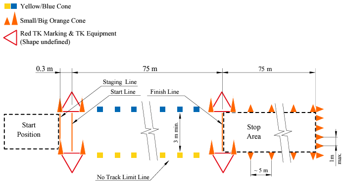
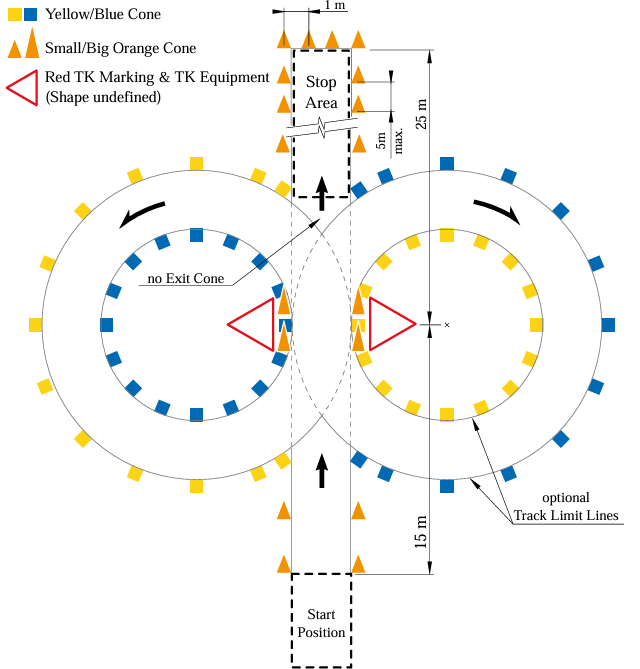
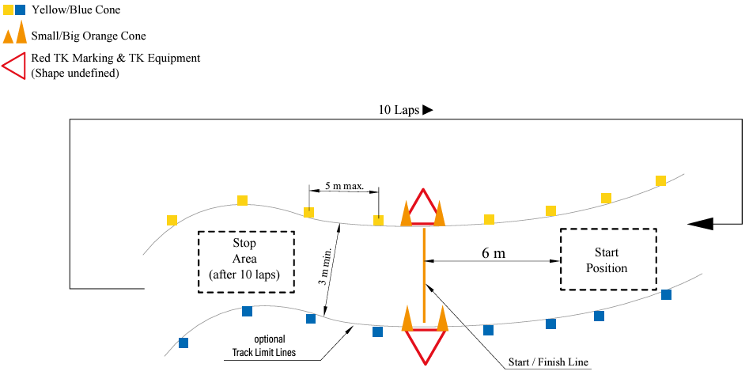

# Driverless Disciplines

Formula Student has four driverless disciplines:

- [Acceleration](#acceleration)
- [Skidpad](#skidpad)
- [Autocross](#autocross)
- [Trackdrive](#trackdrive)

In each event, the car is supposed to drive by itself on tracks constructed from specific traffic cones. The position and distance of Cones is defined by the handbook.
The “easiest” ones are DV Acceleration and DV Skidpad because the track layout is well known beforehand. In fact, for DV Skidpad, all cones have a known position, although the true track may differ slightly.

## Acceleration

??? info 

    This Discipline is part of both the EV competition and DV Cup.

In the DV Acceleration event, the car should drive 75 meters straight as fast as possible. After the first 75 meters, the car has an additional 75 meters to come to a complete stop. Timing equipment is placed such that the timer starts the moment the car starts to move and stops when it reaches the 75-meter mark.

## Skidpad

??? info 

    This Discipline is part of both the EV competition and DV Cup.

In DV Skidpad, the car starts in the start box and should do the first two laps in the right circle, followed by two laps in the left circle. Only the second lap of each circle is timed, and the final time is found by averaging the time of each timed lap. In the end, the car should drive straight and stop in the stop box.

## Autocross

??? info 

    This Discipline is only part of the DV Cup.

In DV Autocross, the car is supposed to complete one lap around an unknown circuit and then come to a complete stop. The left track boundary is indicated by blue cones, and the right boundary is indicated by yellow cones. 

## Trackdrive

??? info 

    This Discipline is only part of the DV Cup.

Trackdrive is similar to DV Autocross, but in this event, the car should complete ten laps before coming to a stop.Up until 2024, the track for Trackdrive was the same as for DV Autocross, meaning that if you completed DV Autocross, it was possible to preload the cone map for Trackdrive, making it easier to complete if you completed DV Autocross, but as of 2024, this is no longer the case.

