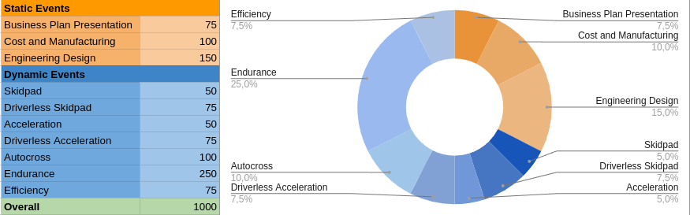
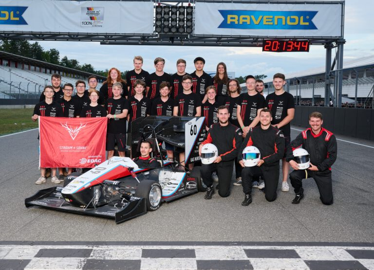

# Formula Student

## Overview

Formula Student is an international design competition where teams of students from different universities around the globe build race cars and compete against each other. 

It’s the world’s largest engineering competition for students and "Strohm und Söhne" competes with a new car each year.

In practice, Formula Student is a set of multiple events in different countries taking place in the summer, usually at different well known racing tracks, such as the Hockenheimring.

Each team must follow a large set of rules in order to be eligible to compete, and different competitions may have different rules. Not all competitions involve disciplines with autonomous driving, but the most desired competition of them all, Formula Student Germany (FSG), does.

Driverless Disciplines are included differently in most Events. Formula Student Germany includes specific Driverless races into the standard EV-Competition while still maintaining a own Driverless Cup. FSEAST, on the other hand, has a own unrelated Driverless Class with no relation to EVs.

## Motivation

At competitions not only the timekeeping of your car is rated. The Events compose of different kinds of dynamic and static events focusing on track performance, but also on financial and design decisions as well as your ability to shine at a business plan presentation showing off your startup. This results in an interdisciplinary rating of not only the car, but also the team itself.

To give you a better overview of point distribution and importance of different tasks we provided you with a point distribution chart of Formula Student Germany:

As you can see, Driverless takes a huge part in the normal EV contest, not to mention the own Driverless Cup making up a whole different leader board of just autonomous competition.

