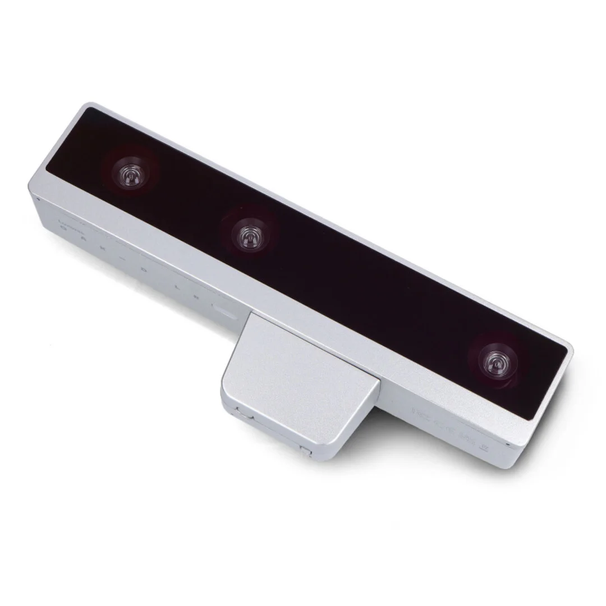
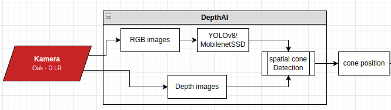
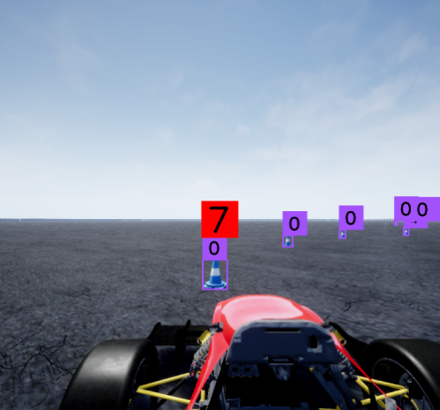
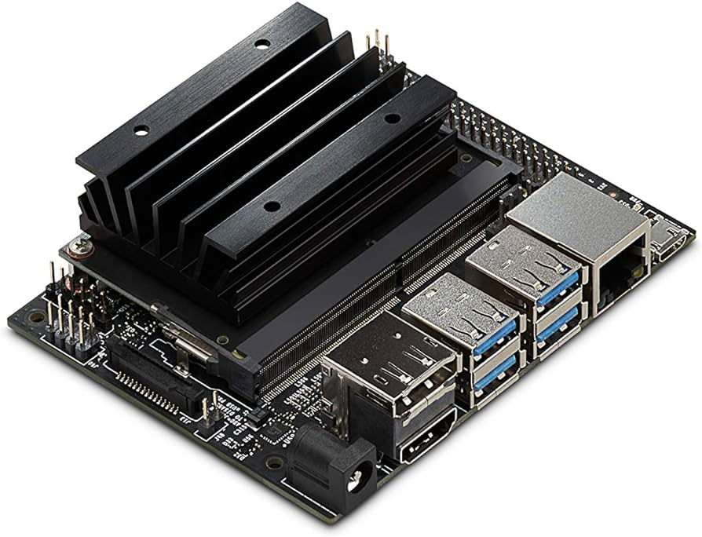
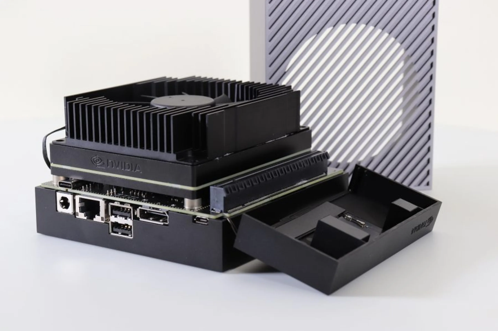
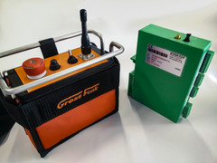

# Hardware

## Camera

We are using the Oak-D LR by Luxonis as our main Perception System. It consists of three stereo color cameras. It has an integrated RVC2 (Robotics Vision Core 2) and detects, as well as calculates distances to trained objects - in our case traffic cones. This enables us to outsource a lot of computing power.

### Perception Pipeline

We use a Perception Pipeline to identify cones that mark the track limits. When overlaying two images, where the source cameras have a fixed relative distance from each other you can create a DepthImage of your surroundings. At the same time cones get detected and marked by a bounding box. We then overlay the bounding boxes with the depth image and output the median as a 3D-Point (a detected cone).

## Computing Unit

For testing purposes, we currently use a NVIDIA Jetson Nano, a small but quite strong piece of hardware. Unfortunately, it won’t be strong enough to run process our whole data in our finished car.

For in-field usage we evaluated the Jetson Orin AGX to best fit our needs. It has a integrated CAN-Adapter for in-car communication and provides a strong graphics as well as computing unit.

## Autonomous System Master Switch (ASMS)

The ASMS is the main manual control to change between the driver and autonomous state of the car. It has to be clearly visible and indicated by a blue circle. It connects and disconnects driverless actuators like steering and brake from the System, dependent on the car's state.

!!! note
    More information can be found in the [official rules of Formula Student Germany](https://www.formulastudent.de/fsg/rules/) under section __T14.6__.

## Steering

In order to move the car left or right, we need to use a steering actuator. In our case, this is realized by connecting a small electric motor to the steering rod, thus making it our steering API. The car hast to function normally in driver state. We can detach the motor from the steering system with a simple sliding mechanism.

!!! note
    More information can be found in the [official rules of Formula Student Germany](https://www.formulastudent.de/fsg/rules/) under section __T14.7__.

## Autonomous System Status Indicator (ASSI)

FSG defined an Indication System for different States of the Autonomous System. In order to recognize which state the car is currently in, you are required to implement three ASSIs. This ensures that the current car state can be seen from every angle around the car. In case of the state "AS Emergency" the car has to emit a certain sound sequence.

<table>
  <tr>
    <th>State</th>
    <td>AS Off</td>
    <td>AS Ready</td>
    <td>AS Driving</td>
    <td>AS Emergency</td>
    <td>AS Finished</td>
  </tr>
  <tr>
    <th>ASSI</th>
    <td>off</td>
    <td>yellow continuous</td>
    <td>yellow flashing</td>
    <td>blue flashing</td>
    <td>blue continuous</td>
  </tr>
</table>

!!! note
    More information can be found in the [official rules of Formula Student Germany](https://www.formulastudent.de/fsg/rules/) under section __T14.10__.

## Autonomous System Brake (ASB)

In order to run in autonomous mode, a vehicle needs to be equipped with an ASB. Parallel usage with the normal break has to be possible (taking in the higher force of both). The Autonomous System Brake must be detachable with maximum two deactivation points. Our ASB Concept uses a 300 bar pressure tank and narrows it down to 10 bar, that can be dosed by a valve the autonomous system can control.

!!! note
    More information can be found in the [official rules of Formula Student Germany](https://www.formulastudent.de/fsg/rules/) under section __T15.1__.

### Emergency Brake System (EBS)

As a part of the ASB, each Car is required an Emergency Break System that can be activated automatically or remotely on failure of the car. Deceleration must be at least $10 \frac{m}{s} with a maximum initiation latency of 200 ms upon activation. 

!!! note
    More information can be found in the [official rules of Formula Student Germany](https://www.formulastudent.de/fsg/rules/) under section __T15.2__ and __T15.4__.

### Emergency Control Unit (ECU)

Because the EBS and ASB have to be monitored for failure at any given time (also in manual mode), we need an resource efficient solution for supervising the ASB. We propose a independent Microcontroller evaluating pressure information including a activation mechanism for the brakes.

## Remote Emergency System (RES)

The Remote Emergency System is directly integrated into the Shutdown Circuit of the Driverless Car. It consists of a receiver and sender-unit based on radio-frequency. This enables a manual remote shutdown of the Driverless System and car in case any fatal mistakes can be recognized from the outside. Another essential function is the "Go"-Button, which is used to start an autonomous mission. Formula Student Teams buy a prebuilt RES from [Gross Funk](https://www.formulastudent.de/fileadmin/user_upload/all/2017/important_docs/FSG2017_Gross-Funk_v20170126.pdf).

!!! warning
    This is an older version of the RES from around 2017. There have been multiple updates, but there are no newer product sheets to be found.

!!! note
    More information can be found in the [official rules of Formula Student Germany](https://www.formulastudent.de/fsg/rules/) under section __T14.3__.