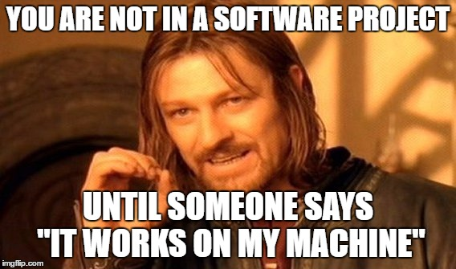
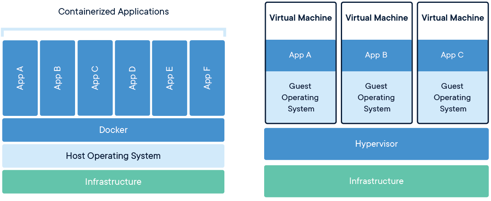
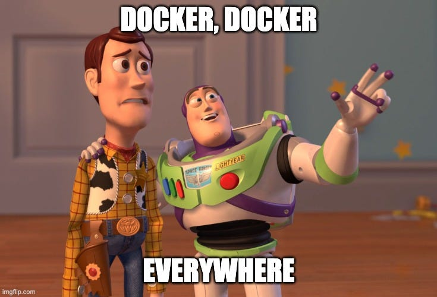

# Docker

You all may be aware of a common problem when working together on a project. You clone the source code, try to run it as described in the README and it does not work. Despite all your efforts some dependencies are not meeting the requirement or perhaps the planets are not aligned right and you are not getting the desired result costing you x hours of your life. And to top it off, none of the other developers can help you, because they never encountered this problem. The only feedback you will get is: "But it runs on  machine?"



A lot of programmers encountered such problems over and over again and decided to bring up a solution: ✨**Containerization**✨

One of the most popular Containerization Tools is Docker. Since our source code only works with a quite complex pack of dependencies including a specific Operating System and Software Versions the easiest way to ensure compatibility is to make use of this concept.

## What is Docker?

Wikipedia defines [Docker](https://en.wikipedia.org/wiki/Docker_(software)) as

!!! quote 

    a tool that is used to automate the deployment of applications in lightweight containers so that applications can work efficiently in different environments in isolation.

This means, Docker is able to deploy a sandbox, while using your directly using Hardware over your OS configuration. You can define every low level aspect of this sandbox, which removes any overhead and makes the container very small and efficient. This also means you can define every dependency a application might need to run beforehand. This container can be shared with images and run independent of the host computer.

## What are containers?

In the case of Virtual Machines (right diagram), the application is run on virtual hardware provided by the host OS. This results in additional Overhead and the need to define Guest Operating Systems, decreasing efficiency. 

Containers (left diagram) make this distinction on the App level. Containers are using direct hardware based on OS Architecture, only packaging the Application and its dependencies.



## Images

In the world of Docker an image is like a template. Images are the base, containers are created from. It bundles application and dependencies together and stores a version or checkpoint. Every time you start a container you create an individual instance based on this image. Images can be shared over [Docker Hub](https://hub.docker.com/) or built with a Dockerfile.

## Docker Daemon

THe Docker Daemon is the process that keeps track of files and containers and manages all the memory and storage reservations that might be needed. It makes using Docker easy for us.

## Exercise

### 0 Checking Setup

In the [Prerequisites](index.md/#prerequisites) you should already have installed Docker Desktop. Docker Desktop is Application Providing an easy to use UI Interface with underlying Docker Engine. This makes monitoring and handling Containers and Images easier.

To check if Docker Desktop is running and your installation was successful run following command:

```bash
docker run hello-world
```

Output:

```bash
Hello from Docker!
This message shows that your installation appears to be working correctly.
```

### 1 Command Line Interface

#### 1.1 Pulling Images

One of the widest spread Docker Images is the `Busybox`. It is lightweight application packaging many basic Unix utilities. The image can be found remotely on [Docker Hub](https://hub.docker.com/_/busybox), where it has been uploaded.

First of all we have to retrieve busybox from the share using the `pull`-command.

```bash
docker pull busybox:latest
```

!!! note

    Depending on how you've installed docker on your system, you might see a `permission denied` error after running the above command. If you're on a Mac or Windows, make sure the Docker engine is running. If you're on Linux, then prefix your `docker` commands with `sudo`. Alternatively, you can create a docker group to get rid of this issue.

We defined which image to pull by providing the name (`busybox`) and the tag(`latest`). The tag `latest` will always get the newest available image. Normally different versions or build architectures get classified by tags.

Now we can have a look at our available images with:

```bash
docker images
```

Returning:

```bash
REPOSITORY      TAG         IMAGE ID        CREATED         SIZE
busybox         latest      27a71e19c956    9 days ago      4.27MB
```

#### 1.2 Running Containers

Now that we have a local copy of the image we can use it to run our own containers. The basic command for creating containers is the run-command.

```bash
docker run busybox
```

Hm. It seems like nothing happened. Just another command line opening up. 

In reality a lot did happen, we just could not see it. With the `docker run` command we create an container from an image and inject a command to run in the created container. The mistake we made is: We did not provide a command.

Let's try again.

```bash
docker run busybox echo "hello world from busybox"
```

Now that we provided a command to run inside the container we also get some feedback from the command. We injected an the `echo` command, which outputs the given string to the console. After its deed is done the container disappears again and gets deleted.

!!! tip

    If you want to verify this process take a look at the currently running containers with this command.

    ```bash
    docker ps
    ```

    Because no Container is active you should receive a list with zero entries as an output. Each Container is tracked by an ID for troubleshooting and interaction purposes.

    ```bash
    CONTAINER ID        IMAGE               COMMAND             CREATED             STATUS              PORTS               NAMES
    ```

    You also can display the full history of containers that ran before:

    ```bash
    docker ps -a
    ```

    Now the output list should be populated with entries.

Being able to only run a single command inside a container and have it disappear again afterwards would be wasteful. That is why Docker provides a way to open interactive Sessions inside a Container. This is indicated by the `-it` flag. You can specify the shell-type with the string behind the container name. Here `sh` for shell. You can specify any other shell available on the image here.

```bash
docker run -it busybox sh
```

Exiting the interactive container can easily be done by entering the command `exit`.

#### 1.3 Detached Containers

Having a Container you can interact with on the command line is nice. But this only utilizes a small portion of what is possible with this tool. Next we will have a look at the `nginx`-Image and start it in detached mode signaled by `-d` This tells the Docker Daemon to keep the container running in the background.

```bash
docker run -p 8080:80 -d --name nginx nginx:latest 
```

You can see that additionally to the `-d`-Flag we also added a `name`. This makes containers easier to handle, since we can address them with something else than a random ID. With `-p` we opened a port to our container. Examine this by opening [http://localhost:8080/index.html](http://localhost:8080/index.html) in your Browser.

You should be able to see a "Welcome-Message". Right now you are accessing a Website hosted by the Container running in the background.

But having a process consuming computing power in the background if you do not need it is bad. To stop the container, run:

```bash
docker stop nginx
```

After reloading your Browser you should receive a connection error. 

Imagine you want to resume showing your project hosted in the container and do not want to remember the commands to bring up the right port every time.

```bash
docker start nginx
```

This brings up the container again. With the same config right where you left off.

And if you do not need the container at all you can just remove it completely.

```bash
docker remove nginx
```

### 2. Dockerfile

#### 2.1 Syntax

Of course you are not limited to using already existing images. You can also configure your own Docker images using Dockerfiles. 

You can find an example Dockerfile in the [driverless-onboarding](https://gitlab.com/strohm-und-soehne/driverless/driverless-onboarding) repository you cloned in the [Git Section](git.md). Just navigate to exercise-docker and open exercise.Dockerfile in your editor.

```Dockerfile title="exercise.Dockerfile"
# Set the base image
FROM python:3.12

# Define the workspace
WORKDIR /app

# Copy the application requirements into the Docker Container, just add python packages, e.g. numpy
COPY requirements.txt ./
# Install the requirements
RUN pip install --no-cache-dir -r requirements.txt

# Copy in the source code
COPY app/ app/

# Set the Username
ENV USER_NAME=World

# Add a User with earlier set Username
RUN useradd ${USER_NAME}
# Switch to the User created above
USER ${USER_NAME}

# Command that is automatically executed when running the image 
CMD ["python", "app/example.py"]
```

A Dockerfile is Composed of Layers. Each highlighted command represents a Image Layer. When you change some dependencies or codes inside the Dockerfile building a image will result in starting from the last unchanged Layer acting as a checkpoint.

Here is a Overview of commonly used instructions:

- `FROM <image>` - this specifies the base image that the build will extend.
- `WORKDIR <path>` - this instruction specifies the "working directory" or the path in the image where files will be copied and commands will be executed.
- `COPY <host-path> <image-path>` - this instruction tells the builder to copy files from the host and put them into the container image.
- `RUN <command>` - this instruction tells the builder to run the specified command.
- `ENV <name> <value>` - this instruction sets an environment variable that a running container will use.
- `EXPOSE <port-number>` - this instruction sets configuration on the image that indicates a port the image would like to expose.
- `USER <user-or-uid>` - this instruction sets the default user for all subsequent instructions.
- `CMD ["<command>", "<arg1>"]` - this instruction sets the default command a container using this image will run.

#### 2.2 Building an Image

Now that we have instructions to create an Image we need to tell the Docker Daemon to build said image out of the Dockerfile.

Open a Terminal, navigate to driverless-onboarding/exercise_docker and enter this command. 

```bash
docker build -f exercise.Dockerfile -t exercise . 
```

!!! info
    - `build` instructs to build an image
    - `-f` - file, specifies Dockerfile
    - `-t` - tag, specifies tag
    - `.` - specifies the current directory as the reference directory

See the result of your own built image with this:

```bash
docker run exercise:latest
```

Output:

```bash
Hello, World!
```

### 3. Solo Task

At the end of this Docker-Tutorial we want you to modify `exercise.Dockerfile` so the container fulfill following requirements:

- When run execute `exercise.py`
- Add module `numpy` as a dependency
- Be able to take the environment variables `USER_NAME`, `GREETING`, `NUM_ARRAY` from the commandline with `docker run -e ENV_VAR ...`, they should have the respective default values:
    - `USER_NAME=World`
    - `GREETING=Hello`
    - `NUM_ARRAY=1,2,3,4,5`
- Change the base image to python version 3.10

When you are finished commit and push your results to your own branch from the [git-Tutorial](git.md). 

!!! note

    Example Input:

    ```bash
    docker run -e USER_NAME="Alice" -e GREETING="Hi" -e NUM_ARRAY="10,20,30,40" your-image
    ```

    Expected Output:

    ```bash
    Hi, Alice! The sum of [10 20 30 40] is 100.
    ```

