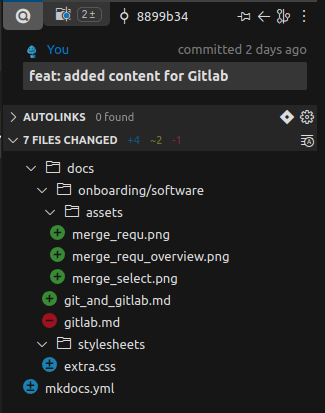
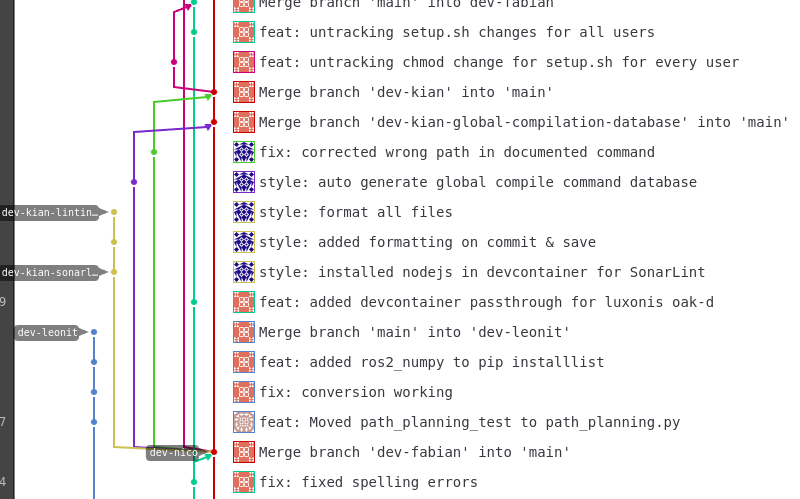
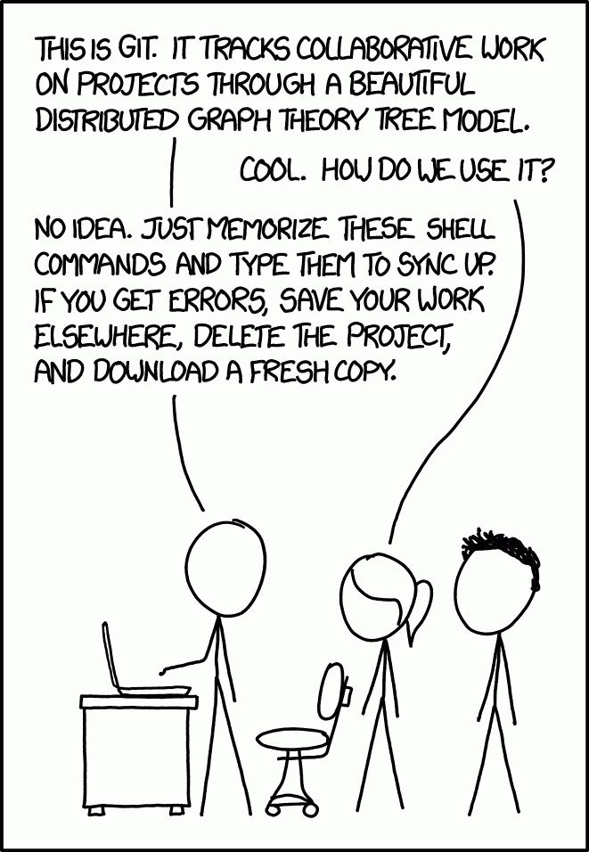
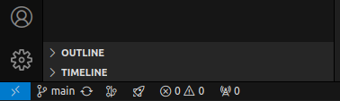
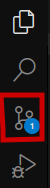

# Git

Git is a distributed version control system that allows multiple developers to track changes in source code, collaborate, and manage project history efficiently. It enables teams to work on different features or fixes simultaneously without overwriting each other's work. Git was created by Linus Torvalds in 2005 to support the development of the Linux kernel after a dispute over the licensing of a previous version control system. Since then, it has become the most widely used tool for source code management.

## Basic Concepts

When wanting to collaborate on a project, simultaneous editing of files can lead to a lot of conflicts. Git offers concepts to solve this problem.

### Remote Repository

Your project is located in a so called repository. Here all source files are structured and saved. A repository is always hosted at a remote location, e.g. Github or Gitlab. This ensures multiple users can access the repository and any loss or accidental deletion of local files is not affecting the project state.

### Cloning

The remote repository is only meant for storing files and additional information, not for editing or running your application. This is why, when wanting to work or use a git project you need to clone the remote repository to your Notebook or PC. This creates a local version which is still connected to the remote repository.

When you change source code in your local version of the project they wont be automatically synched with the remote repository. This has the big advantage of being able to explore and tryout different approaches you want to implement without worrying about potentially destroying other implementations. Whenever you feel like your changes are faulty and went in a wrong direction you can scrap your local changes and start anew from the remote version.

### Commits

But what if you made some changes working on a new feature and want to save your progress up till now - this is where commits come in.

Commits represents a set of modifications, such as added, deleted, or altered files, along with a descriptive message explaining the changes. Each commit acts like a checkpoint, allowing developers to track the history of a project, revert to earlier versions, and collaborate without losing previous work. Commits also include metadata, like the author's name, timestamp, and a unique identifier (hash), making it easy to manage and reference changes.



### Pushing, Branches

Right now these Commits are only available locally. This defeats the idea of using git to collaborate together on one project. That is why we need a way to get our local changes into the remote repository.

The most straight forward solution is directly pushing your commits to the remote repository. This overrides the current repository with your local one while keeping information about earlier versions. (Taking Commits as version checkpoints). This is normal practice when you work on a small project and fully trust every participant.

On bigger projects Branches come into the big pictures. These are parallel versioning strings of the same repository. We have a `Main`-Branch, which you need certain permissions to push to. For everyone else we suggest creating a feature-based branch that does not interfere with `Main`. The idea behind this concept is to always have a functioning version protected from potential faulty changes.



### Merging

When working with branches it often happens, that both branches get developed further and at some point need to be combined again. E.g. adding content to the `Main`-Branch. To prevent conflicts Git proposes the concept of merging. This compares both branches and prompts the user to decide on how to handle conflicts like making changes on the same file.

## Exercise

To deepen your knowledge of Git please follow and participate in these tasks.



### 0 Checking Setup

First we need to ensure git is working on your System. Note that you have to install Git and Visual Studio as described in the [Prerequisites](./index.md/#prerequisites).

Open a Terminal or Command Line. Copy following command.

```bash
git --version &&
code --version
```

Output:
```bash
git version 2.34.1
1.93.1
38c31bc77e0dd6ae88a4e9cc93428cc27a56ba40
x64
```

If you get an similar output you are ready to go.

### 1 Cloning the example Repository

 and navigate to the directory you want to clone the repository into. Enter following Command.

```bash
git clone https://gitlab.com/strohm-und-soehne/driverless/driverless-onboarding.git -b main
cd driverless-onboarding
```

!!! note
    You may be prompted to enter your Username and Password. Use your Gitlab-Account credentials for this.

Open the repository in Visual Studio Code.

```bash
code .
```

You should be prevented with this view.

TODO Screenshot

### 2 Creating a new branch.

In the bottom left of your screen you can see the current branch you are in. Currently this is `main`. We defined this with setting the `-b`-Flag in the command in [1.](#1-cloning-the-example-repository) 



Let's create your own branch you can work on:

```bash
git branch exercises-<your-name>
git checkout exercise-<your-name>
```

!!! note 
    Replace `<your-name>` with your first and last name.

### 3 Committing

#### 3.1 Command Line

In order to commit something we need to make changes to the project. In our case we will create a new .txt-file and add content.

- right click on the explorer-view
- select new file
- name it `motivation.txt`
- write one or two sentences on what motivated you to join "Strohm und Söhne"

When you are finished and **saved** the file we can go back to the terminal.

In order to commit some files paired with a Commit-Message we need to add these files to the staging area first.

```bash
git add motivation.txt
```

You can have a look at the current staged files with:

```bash
git status
```

When you can see `motivation.txt` listed as staged you are ready to go.
When committing all currently staged changes are being added to the commit.
The normal workflow is: Stage Changes &#8594; Commit Files. 

```bash
git commit -m "feat: added motivation.txt"
```

This produces a commit. If you are curious about how to structure a commit message we have a guideline [here](../../development_and_standards/commits.md).

Last but not least we need to push our commit to our remote repository.

```bash
git push
```

#### 3.2 VSCode Source Control

For a more user friendly interface to Git VSCode provides its own UI.

First we need to make some changes again. Just edit `motivation.txt` and add a line on why you chose to be part of the Driverless department. Save the file.

Now select `Source Control` on the explorer to the left. 



Here you have an Interface to add changes to the staging area and commit them. 

Go ahead and push this next commit with your own message.

