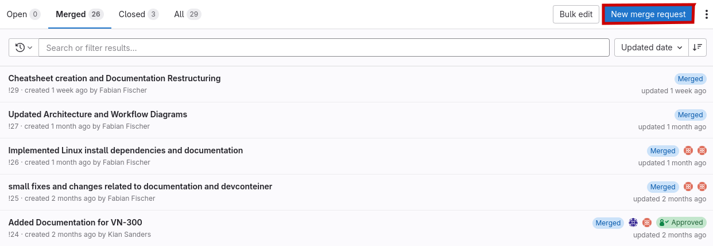

# Gitlab

As you may have noticed our Team uses Gitlab for all Software and Coding related Tasks. As a matter of fact: You need a Gitlab Account to be able to read this.

As a member of the "Strohm und Söhne" group you have access to all repositories created by our members. To organize our Repository we created groups depending on our cars. You can find the current cars Repositories [here](https://gitlab.com/strohm-und-soehne/nora-11). 

## Structure

Our main repository is called `Autonomous System`. This is where the whole magic is happening and documentation takes place. We also have a project called `Driverless Onboarding`, you will learn more about later. Any external code we import from manufacturer or other projects is located in the `Submodules`-Folder. From there we link them into the `Autonomous System`-Repository. `Other` is a archive of personal projects or tests related to the Driverless Project.

### Wiki

Starting with Nora11, a Wiki repository is also part of our structure. Here the Mechanical and Electrical Engineering department are documenting their work and findings as well as investigations and decision making for future members to build their knowledge on. Feel free to take a look using [this link](https://gitlab.com/strohm-und-soehne/nora-11/wiki/-/wikis/NoRa-11-Wiki).

## Driverless Documentation

Beneath the creation of wikis Gitlab also provides the usage of Pages. This enables users to create full websites out of their repository. What you are reading right now is hosted on a so called Page. We are structuring the source files for this documentation inside our repository. Whenever we push something to the main branch a new version of our documentation gets rendered and hosted on a Gitlab Pages using a CI/CD pipeline.

## Merge Requests

In order to get your own branch into our protected main branch and thus update the documentation you need to create a merge request, sometimes also called a pull request. This results in you offering your changes for a review by a person having more access rights than you. If your implementation is selected to be executed well your branch will be combined with the protected branch, if not feedback ist provided.

### Creating a merge request.

In order to create a merge request you first have to push your changes to your own branch. On the Website UI of Gitlab navigate to the desired project and select <kbd>Merge requests</kbd>.

Here all currently open merge requests are listed. By navigating on the tabs on the top left you also can view a summary of all merged or closed requests.
In order to open a new request please select the blue button <kbd>New merge request</kbd>.

The next step is to select the source repository and branch you want to merge into the main upstream. 

Now you are almost finished. The only thing missing is describing your changes an choosing a fitting name. You also should add a responsible with sufficient access rights to review your work. If you are done and made sure what you want to merge into the main repository is implemented well enough you can hit the blue button <kbd>Create merge request</kdb>, which will notify all required members for completing the merge.

## CI/CD Pipelines

CI/CD stands for "Continuous Integration and Continuous Deployment". Its one of the bases of the so called DevOps strategy. It is widely used to encourage higher frequency of code delivery and ease the testing stage of code for developers. This is achieved by introducing a project specific workflow relying on CI and CD.

### Continuous Integration

Continuous Integration describes merging code changes early and frequently into the main branch. The idea is to have a pipeline of automated tests that is checked whenever a merge is happening. This results in documenting possible errors in small steps and gives direct feedback to the developer. Ensures early detection of security faults and potential problems is the main task of CI.

### Continuous Deployment

Continuous Deployment ensures your project gets built and delivered correctly. It ensures all dependencies are met and can deploy the finished product directly at the target hardware. All that without one manual step. In our specific case this would mean we can update changes to the software of our Autonomous System remote, with one button push on the Gitlab Website.

!!! warning

    Currently only deployment of our Driverless Documentation (Gitlab Pages) is part of our CI/CD. Nonetheless we prioritize and aim for more automated testing and deployment. This task stands and falls with the developers, which are responsible for creating sufficient and useful tests.