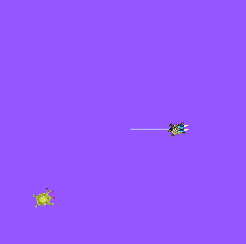

# 5. Parameters

A parameter is a configuration value of a node. You can think of parameters as node settings. A node can store parameters as integers, floats, booleans, strings, and lists. In ROS 2, each node maintains its own parameters. 

## 5.1 Setup

Start up the two turtlesim nodes, `/turtlesim` and `/teleop_turtle`.

Open a new terminal and run:

```bash
ros2 run turtlesim turtlesim_node
```

Open another terminal and run:

```bash
ros2 run turtlesim turtle_teleop_key
```

## 5.2 ros2 param list

To see the parameters belonging to your nodes, open a new terminal and enter the command:

```bash
ros2 param list
```

You will see the node namespaces, `/teleop_turtle` and `/turtlesim`, followed by each node’s parameters:

```bash
/teleop_turtle:
  qos_overrides./parameter_events.publisher.depth
  qos_overrides./parameter_events.publisher.durability
  qos_overrides./parameter_events.publisher.history
  qos_overrides./parameter_events.publisher.reliability
  scale_angular
  scale_linear
  use_sim_time
/turtlesim:
  background_b
  background_g
  background_r
  qos_overrides./parameter_events.publisher.depth
  qos_overrides./parameter_events.publisher.durability
  qos_overrides./parameter_events.publisher.history
  qos_overrides./parameter_events.publisher.reliability
  use_sim_time
```

Every node has the parameter `use_sim_time`; it’s not unique to turtlesim.

Based on their names, it looks like `/turtlesim`’s parameters determine the background color of the turtlesim window using RGB color values.

To determine a parameter’s type, you can use `ros2 param get`.

## 5.3 ros2 param get

To display the type and current value of a parameter, use the command:

```bash
ros2 param get <node_name> <parameter_name>
```

Let’s find out the current value of `/turtlesim`’s parameter `background_g`:

```bash
ros2 param get /turtlesim background_g
```

Which will return the value:

```bash
Integer value is: 86
```

Now you know `background_g` holds an integer value.

If you run the same command on `background_r` and `background_b`, you will get the values `69` and `255`, respectively.

## 5.4 ros2 param set

To change a parameter’s value at runtime, use the command:

```bash
ros2 param set <node_name> <parameter_name> <value>
```

Let’s change `/turtlesim`’s background color:

```bash
ros2 param set /turtlesim background_r 150
```

Your terminal should return the message:

```
Set parameter successful
```

And the background of your turtlesim window should change colors:



## 5.5 ros2 param dump

You can view all of a node’s current parameter values by using the command:

```bash
ros2 param dump <node_name>
```

```bash
/turtlesim:
  ros__parameters:
    background_b: 255
    background_g: 86
    background_r: 150
    qos_overrides:
      /parameter_events:
        publisher:
          depth: 1000
          durability: volatile
          history: keep_last
          reliability: reliable
    use_sim_time: false
```

Dumping parameters comes in handy if you want to reload the node with the same parameters in the future.