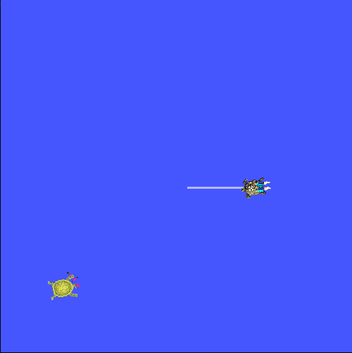

# 4. Services

Services are another method of communication for nodes in the ROS graph. Services are based on a call-and-response model versus the publisher-subscriber model of topics. While topics allow nodes to subscribe to data streams and get continual updates, services only provide data when they are specifically called by a client.


## 4.1 Setup

Start up the two turtlesim nodes, `/turtlesim` and `/teleop_turtle`.

Open a new terminal and run:
```bash
ros2 run turtlesim turtlesim_node
```

Open another terminal and run:

```bash
ros2 run turtlesim turtle_teleop_key
```

## 4.2 ros2 service list

Running the ros2 service list command in a new terminal will return a list of all the services currently active in the system:

```bash
/clear
/kill
/reset
/spawn
/teleop_turtle/describe_parameters
/teleop_turtle/get_parameter_types
/teleop_turtle/get_parameters
/teleop_turtle/list_parameters
/teleop_turtle/set_parameters
/teleop_turtle/set_parameters_atomically
/turtle1/set_pen
/turtle1/teleport_absolute
/turtle1/teleport_relative
/turtlesim/describe_parameters
/turtlesim/get_parameter_types
/turtlesim/get_parameters
/turtlesim/list_parameters
/turtlesim/set_parameters
/turtlesim/set_parameters_atomically
```

You will see that both nodes have the same six services with `parameters` in their names. Nearly every node in ROS 2 has these infrastructure services that parameters are built off of. There will be more about parameters in the next tutorial. In this tutorial, the parameter services will be omitted from the discussion.

For now, let’s focus on the turtlesim-specific services, `/clear`, `/kill`, `/reset`, `/spawn`, `/turtle1/set_pen`, `/turtle1/teleport_absolute`, and `/turtle1/teleport_relative`. 

## 4.3 ros2 service type

Services have types that describe how the request and response data of a service is structured. Service types are defined similarly to topic types, except service types have two parts: one message for the request and another for the response.

To find out the type of a service, use the command:

```bash
ros2 service type <service_name>
```

Let’s take a look at turtlesim’s `/clear` service. In a new terminal, enter the command:

```bash
ros2 service type /clear
```

Which should return:

```bash
std_srvs/srv/Empty
```

The `Empty` type means the service call sends no data when making a request and receives no data when receiving a response.

To see the types of all the active services at the same time, you can append the `--show-types` option, abbreviated as `-t`, to the list command:

```bash
ros2 service list -t
```

## 4.4 ros2 interface show

You can call services from the command line, but first you need to know the structure of the input arguments.

```bash
ros2 interface show <type_name>
```

Let’s introspect a service with a type that sends and receives data, like `/spawn`. From the results of `ros2 service list -t`, we know `/spawn`’s type is `turtlesim/srv/Spawn`.

To see the request and response arguments of the `/spawn` service, run the command:

```bash
ros2 interface show turtlesim/srv/Spawn
```

Which will return:

```bash
float32 x
float32 y
float32 theta
string name # Optional.  A unique name will be created and returned if this is empty
---
string name
```

The information above the `---` line tells us the arguments needed to call `/spawn`. `x`, `y` and `theta` determine the 2D pose of the spawned turtle, and name is clearly optional.

The information below the line isn’t something you need to know in this case, but it can help you understand the data type of the response you get from the call.

## 4.4 ros2 service call

You already used this command at the start og the ROS Exercise. Now we want to dive deeper into what exactly is happening.

You now know what a service type is, how to find a service’s type, and how to find the structure of that type’s arguments, you can call a service using:

```bash
ros2 service call <service_name> <service_type> <arguments>
```

Now let’s spawn a new turtle by calling `/spawn` and setting arguments. Input `<arguments>` in a service call from the command-line need to be in YAML syntax.

Enter the command:

```bash
ros2 service call /spawn turtlesim/srv/Spawn "{x: 2, y: 2, theta: 0.2, name: ''}"
```

You will get this method-style view of what’s happening, and then the service response:

```bash
requester: making request: turtlesim.srv.Spawn_Request(x=2.0, y=2.0, theta=0.2, name='')

response:
turtlesim.srv.Spawn_Response(name='turtle2')
```

Your turtlesim window will update with the newly spawned turtle right away:

