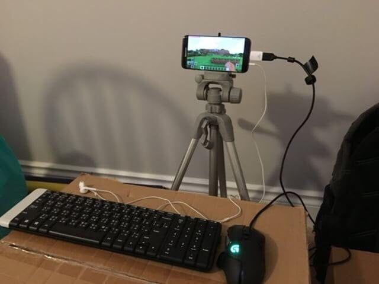

# 0. Setup

For the following exercise we will need VSCode and Docker. Please start up Docker Desktop if it is not running already. 

Also open the `driverless-onboarding`-Repository in VSCode. You can do that using VSCode, your File-Explorer or the terminal. In VSCode we need to install an extension called `Dev Containers`. You can also open up your VSCode Command input using <kbd>Strg</kbd> + <kbd>Shift</kbd> <kbd>P</kbd> and enter this command:

```bash
ext install ms-vscode-remote.remote-container
```

What we will do next is launch an interactive Container called DevContainer since ROS2 performs best on Linux. All configurations are already made in the `.devcontainer`-Folder. You just have to press <kbd>Strg</kbd> + <kbd>Shift</kbd> <kbd>P</kbd> and search for the action: `Dev Containers: Reopen in Container`. This will open the folder `exercise-ros2` inside a container for you to work on. 

