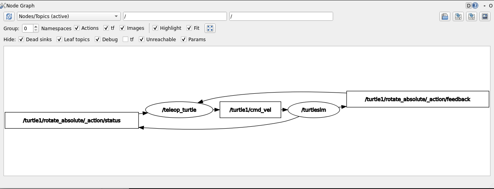
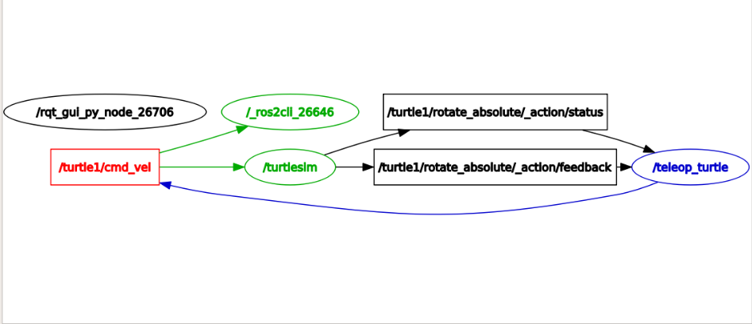

# 3. Topics

ROS 2 breaks complex systems down into many modular nodes. Topics are a vital element of the ROS graph that act as a bus for nodes to exchange messages. A node may publish data to any number of topics and simultaneously have subscriptions to any number of topics.


Topics are one of the main ways in which data is moved between nodes and therefore between different parts of the system.

## 3.1 Setup

By now you should be comfortable starting up turtlesim.

Open a new terminal and run:

```bash
ros2 run turtlesim turtlesim_node
```

Open another terminal and run:

```bash
ros2 run turtlesim turtle_teleop_key
```

## 3.2 rqt_graph

Throughout this tutorial, we will use `rqt_graph` to visualize the changing nodes and topics, as well as the connections between them.

To run `rqt_graph`, open a new terminal and enter the command:

```bash
rqt_graph
```



You should see the above nodes and topic, as well as two actions around the periphery of the graph (let’s ignore those for now).

The graph is depicting how the `/turtlesim` node and the `/teleop_turtle` node are communicating with each other over a topic. The `/teleop_turtle` node is publishing data (the keystrokes you enter to move the turtle around) to the `/turtle1/cmd_vel` topic, and the `/turtlesim` node is subscribed to that topic to receive the data.

## 3.3 ros2 topic list

Running the `ros2 topic list` command in a new terminal will return a list of all the topics currently active in the system:

```bash
/parameter_events
/rosout
/turtle1/cmd_vel
/turtle1/color_sensor
/turtle1/pose
```

`ros2 topic list -t` will return the same list of topics, this time with the topic data type appended in brackets:

```bash
/parameter_events [rcl_interfaces/msg/ParameterEvent]
/rosout [rcl_interfaces/msg/Log]
/turtle1/cmd_vel [geometry_msgs/msg/Twist]
/turtle1/color_sensor [turtlesim/msg/Color]
/turtle1/pose [turtlesim/msg/Pose]
```

These attributes, particularly the type, are how nodes know they’re talking about the same information as it moves over topics.

## 3.4 ros2 topic echo

To see the data being published on a topic, use:

```bash
ros2 topic echo <topic_name>
```

Since we know that `/teleop_turtle` publishes data to `/turtlesim` over the `/turtle1/cmd_vel` topic, let’s use echo to introspect that topic:

```bash
ros2 topic echo /turtle1/cmd_vel
```

At first, this command won’t return any data. That’s because it’s waiting for `/teleop_turtle` to publish something.

Return to the terminal where `turtle_teleop_key` is running and use the arrows to move the turtle around. Watch the terminal where your echo is running at the same time, and you’ll see position data being published for every movement you make:

Now return to `rqt_graph` and uncheck the Debug box.



`/_ros2cli_26646` is the node created by the echo command we just ran (the number might be different). Now you can see that the publisher is publishing data over the `cmd_vel` topic, and two subscribers are subscribed to it.

## 3.5 ros2 topic info

Topics don’t have to only be one-to-one communication; they can be one-to-many, many-to-one, or many-to-many.

Another way to look at this is running:

```bash
ros2 topic info /turtle1/cmd_vel
```

Which will return:

```bash
Type: geometry_msgs/msg/Twist
Publisher count: 1
Subscription count: 2
```

## 3.6 ros2 topic hz

For one last introspection on this process, you can view the rate at which data is published using:

```bash
ros2 topic hz /turtle1/pose
```

It will return data on the rate at which the `/turtlesim` node is publishing data to the pose topic.

```bash 
average rate: 62.493
    min: 0.015s max: 0.017s std dev: 0.00057s window: 64
```

## 3.7 Summary

Nodes publish information over topics, which allows any number of other nodes to subscribe to and access that information. In this tutorial you examined the connections between several nodes over topics using rqt_graph and command line tools. You should now have a good idea of how data moves around a ROS 2 system.