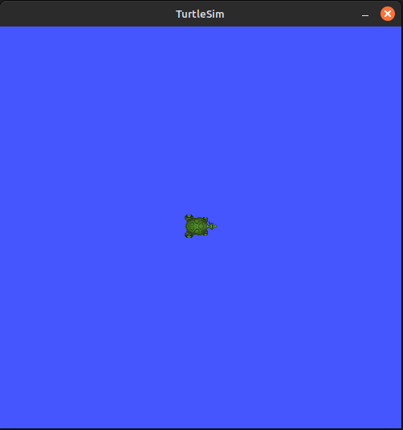
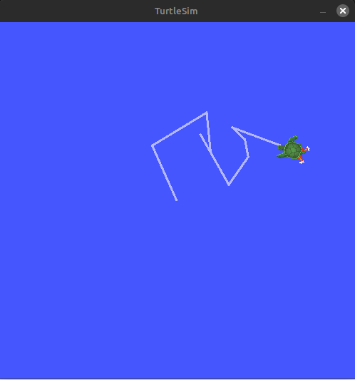

# 1. Turtlesim

Since ROS 2 is themed around turtles it makes sense, that the most basic application is also using turtles. Lets get to know some features with Turtlesim.

## 1.1. Start Turtlesim

Turtlesim should already be installed. Let's make sure it is working.

```bash
ros2 pkg executables turtlesim
```

!!! warning
    Please use the integrated VSCode-Terminal from the DevContainer for the whole ROS2 Tutorial.

Output:

```bash
turtlesim draw_square
turtlesim mimic
turtlesim turtle_teleop_key
turtlesim turtlesim_node
```

To start turtlesim, enter the following command in your terminal:

```bash
ros2 run turtlesim turtlesim_node
```

The simulator window should appear, with a random turtle in the center.



In the terminal, under the command, you will see messages from the node:

```bash
[INFO] [turtlesim]: Starting turtlesim with node name /turtlesim
[INFO] [turtlesim]: Spawning turtle [turtle1] at x=[5.544445], y=[5.544445], theta=[0.000000]
```

There you can see the default turtle’s name and the coordinates where it spawns.

## 1.2 Use Turtlesim

Open a new terminal. Now you will run a new node to control the turtle in the first node:

```bash
ros2 run turtlesim turtle_teleop_key
```

At this point you should have three windows open: a terminal running turtlesim_node, a terminal running turtle_teleop_key and the turtlesim window. Arrange these windows so that you can see the turtlesim window, but also have the terminal running turtle_teleop_key active so that you can control the turtle in turtlesim.

Use the arrow keys on your keyboard to control the turtle. It will move around the screen, using its attached “pen” to draw the path it followed so far.



You can see the nodes, and their associated topics, services, and actions, using the list subcommands of the respective commands:

```bash
ros2 node list
ros2 topic list
ros2 service list
ros2 action list
```

Now that you know what turtlesim is and already take a peak into different types in ros we will try our best to explain to you, what each of these does.